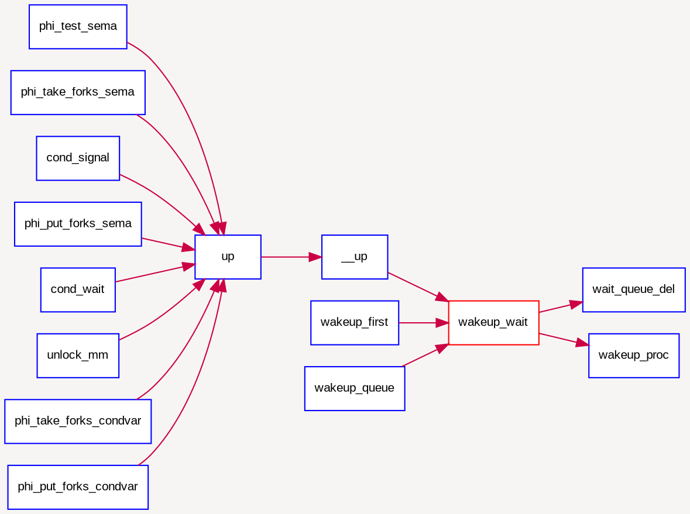
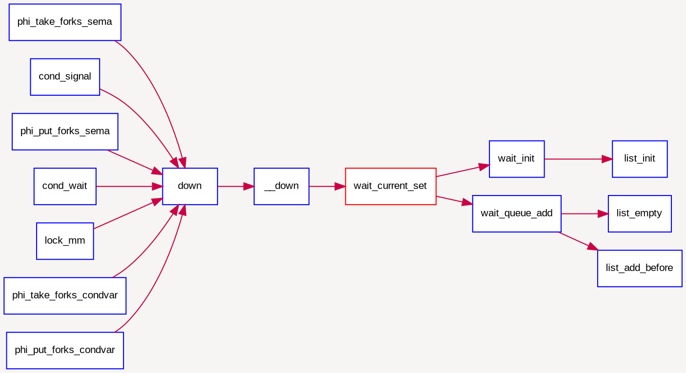

## 等待队列

到目前为止，我们的实验中，用户进程或内核线程还没有睡眠的支持机制。在课程中提到用户进程或内核线程可以转入等待状态以等待某个特定事件（比如睡眠,等待子进程结束,等待信号量等），当该事件发生时这些进程能够被再次唤醒。内核实现这一功能的一个底层支撑机制就是等待队列wait_queue，等待队列和每一个事件（睡眠结束、时钟到达、任务完成、资源可用等）联系起来。需要等待事件的进程在转入休眠状态后插入到等待队列中。当事件发生之后，内核遍历相应等待队列，唤醒休眠的用户进程或内核线程，并设置其状态为就绪状态（PROC_RUNNABLE），并将该进程从等待队列中清除。ucore在kern/sync/{ wait.h, wait.c
}中实现了等待项wait结构和等待队列wait
queue结构以及相关函数），这是实现ucore中的信号量机制和条件变量机制的基础，进入wait
queue的进程会被设为等待状态（PROC_SLEEPING），直到他们被唤醒。

###　数据结构定义
```
typedef  struct {
    struct proc_struct *proc;     //等待进程的指针
    uint32_t wakeup_flags;        //进程被放入等待队列的原因标记
    wait_queue_t *wait_queue;     //指向此wait结构所属于的wait_queue
    list_entry_t wait_link;       //用来组织wait_queue中wait节点的连接
} wait_t;

typedef struct {
    list_entry_t wait_head;       //wait_queue的队头
} wait_queue_t;

le2wait(le, member)               //实现wait_t中成员的指针向wait_t 指针的转化
```

###　相关函数说明
与wait和wait queue相关的函数主要分为两层，底层函数是对wait queue的初始化、插入、删除和查找操作，相关函数如下：

```c
void wait_init(wait_t *wait, struct proc_struct *proc);    //初始化wait结构
bool wait_in_queue(wait_t *wait);                          //wait是否在wait queue中
void wait_queue_init(wait_queue_t *queue);                 //初始化wait_queue结构
void wait_queue_add(wait_queue_t *queue, wait_t *wait);    //把wait前插到wait queue中
void wait_queue_del(wait_queue_t *queue, wait_t *wait);    //从wait queue中删除wait
wait_t *wait_queue_next(wait_queue_t *queue, wait_t *wait);//取得wait的后一个链接指针
wait_t *wait_queue_prev(wait_queue_t *queue, wait_t *wait);//取得wait的前一个链接指针
wait_t *wait_queue_first(wait_queue_t *queue);             //取得wait queue的第一个wait
wait_t *wait_queue_last(wait_queue_t *queue);              //取得wait queue的最后一个wait
bool wait_queue_empty(wait_queue_t *queue);                //wait queue是否为空
```

高层函数基于底层函数实现了让进程进入等待队列--`wait_current_set`，以及从等待队列中唤醒进程--`wakeup_wait`，相关函数如下：

```
//让wait与进程关联，且让当前进程关联的wait进入等待队列queue，当前进程睡眠
void wait_current_set(wait_queue_t *queue, wait_t *wait, uint32_t wait_state);
//把与当前进程关联的wait从等待队列queue中删除
wait_current_del(queue, wait);
//唤醒与wait关联的进程
void wakeup_wait(wait_queue_t *queue, wait_t *wait, uint32_t wakeup_flags, bool del);
//唤醒等待队列上挂着的第一个wait所关联的进程
void wakeup_first(wait_queue_t *queue, uint32_t wakeup_flags, bool del);
//唤醒等待队列上所有的等待的进程
void wakeup_queue(wait_queue_t *queue, uint32_t wakeup_flags, bool del);
```

### 调用关系举例

如下图所示，对于唤醒进程的函数`wakeup_wait`，可以看到它会被各种信号量的V操作函数`up`调用，并且它会调用`wait_queue_del`函数和`wakup_proc`函数来完成唤醒进程的操作。



如下图所示，而对于让进程进入等待状态的函数`wait_current_set`，可以看到它会被各种信号量的P操作函数｀down`调用，并且它会调用`wait_init`完成对等待项的初始化，并进一步调用`wait_queue_add`来把与要处于等待状态的进程所关联的等待项挂到与信号量绑定的等待队列中。


